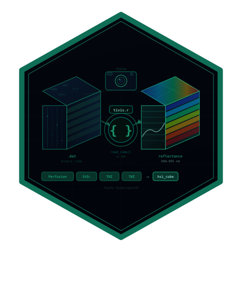

# tivis.r 

[](https://doi.org/10.5281/zenodo.21889970)

<!-- badges: start -->
[](https://github.com/CTTIR/tivis.r/actions/workflows/R-CMD-check.yaml)
[](https://cttir.github.io/tivis.r/)
[](https://lifecycle.r-lib.org/articles/stages.html#experimental)
<!-- badges: end -->

Read hyperspectral recordings written by the **Diaspective Vision TIVITA
Suite**, used for intraoperative tissue and perfusion imaging.

`tivis.r` is the TIVITA counterpart to
[`cuvis.r`](https://github.com/CTTIR/cuvis.r), which covers Cubert snapshot
cameras. The important practical difference: the TIVITA container is a plain
binary format, so **this package needs no vendor SDK and contains no compiled
code** — nothing to install beyond R itself.

Both packages feed [`hyperspectR`](https://github.com/CTTIR/hyperspectR), which
owns the `hsi_cube` class and the analysis pipeline.

## Installation

```r
# install.packages("remotes")
remotes::install_github("CTTIR/tivis.r")
```

## Usage

```r
library(tivis.r)

# Inspect a recording's geometry without reading 123 MB of samples
tivis_read_header("2019_11_25_13_29_24_SpecCube.dat")
#> $width  [1] 640
#> $height [1] 480
#> $bands  [1] 100

# Read the cube: (rows, cols, bands), with wavelengths attached
cube <- tivis_read_cube("2019_11_25_13_29_24_SpecCube.dat")
dim(cube)
#> [1] 480 640 100

# Everything the Suite stored for one capture
m <- tivis_measurement("2019_11_25_13_29_24_SpecCube.dat")
m$metadata$Camera$Exposure
names(m$references)
#> "NIR-Perfusion" "Oxygenation" "RGB-Image" "THI" "TWI"

# Scan an archive cheaply (headers only)
tivis_list_measurements("/archive/tivita")
```

## The file format

TIVITA does not publish a specification, so the format was determined
empirically:

| | |
|---|---|
| Header | 12 bytes: three big-endian `uint32` — width, height, bands |
| Samples | big-endian `float32` |
| Band order | band-interleaved-by-pixel (all bands of a pixel contiguous) |
| Pixel order | **column-major** — y varies fastest |
| Wavelengths | 500–995 nm in 5 nm steps (100 bands) |
| Values | calibrated reflectance; may fall slightly outside `[0, 1]` |

The header decodes to `640, 480, 100` and the file size equals
`12 + 640 × 480 × 100 × 4` exactly. Big-endian `float32` gives physically
plausible reflectance with no non-finite values; little-endian gives thousands
of `NaN`.

The two ordering questions were settled by measuring the sample stream
directly rather than guessing. Autocorrelation of the raw stream peaks at
**lag 100 (r = 0.95)** — the band count — with harmonics at 200, 300 and 400,
which is the signature of band interleaving by pixel. Autocorrelation of a
single extracted band plane then peaks at **lag 480 (r = 0.99)**, the image
*height*, against r = 0.43 at lag 640, the width: pixels run down columns, not
across rows. Rendering with that ordering produces a sharp clinical image;
every other combination produces tiling, striping or noise.

### A note on validating this

An earlier version of this README claimed the layout was validated at
`r = 0.86` against the Suite's `_RGB-Image.png`. That was wrong, and worth
recording. The figure came from correlating **downsampled** images, and the
reference is dominated by horizontal structure that survives horizontal
tiling — so an image tiled four times across still scored 0.86.

The vendor PNG turned out to be unusable as ground truth anyway: it is
rendered at a different size, carries a title bar, and is rotated relative to
the cube, so even the *correct* layout correlates with it at roughly zero. The
thing that actually settled the format was looking at the image, and then
measuring the sample stream's own periodicity — no reference required.

Getting this wrong is easy to miss, because `array()` recycles silently: a
reader with the wrong ordering still returns a full-size, plausible-looking
cube. `tivis_read_header()` therefore validates the file size against the
header, and the tests pin the x/y mapping with an asymmetric feature rather
than only round-tripping the writer against the reader — which is what let the
earlier error pass a green suite.

## Related packages

| Package | Role |
|---|---|
| [`cuvis.r`](https://github.com/CTTIR/cuvis.r) | Cubert `.cu3s` via the CUVIS SDK |
| [`hyperspectR`](https://github.com/CTTIR/hyperspectR) | `hsi_cube` class, preprocessing, tissue indices |
| [`hyperspectaculR`](https://github.com/CTTIR/hyperspectaculR) | Publication-grade visualisation |

## License

MIT

## Citation

If you use this software, please cite it as:

> Heller, R. (2026). *tivis.r: Reading Diaspective Vision TIVITA hyperspectral recordings* (Version 0.1.0) [Computer software]. Zenodo. https://doi.org/10.5281/zenodo.21889970

DOI: [10.5281/zenodo.21889970](https://doi.org/10.5281/zenodo.21889970)
